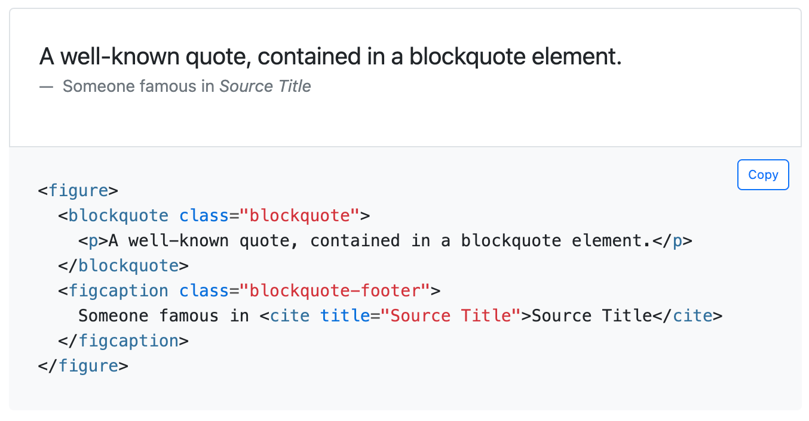
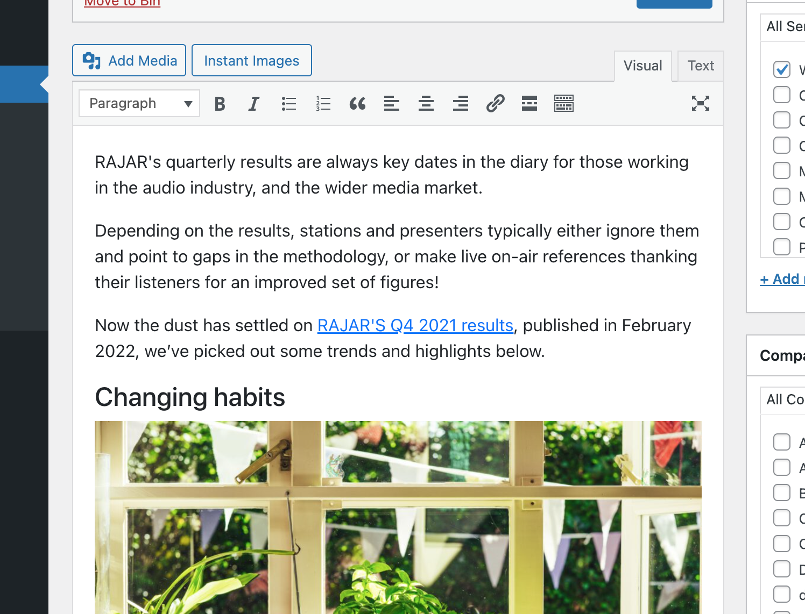

# Context WP Bootstrapify

Tested up to: 5.9.1  
Tags: posts, bootstrap  
Contributors: robertandrews  

## Description

This plugin aims to align WordPress presentational elements with Bootstrap CSS framework, for site owners whose themes utilise Bootstrap.

Specifically, this will present WordPress posts elements, and their editor, using more accurate Bootstrap elements and attributes.

It is intended to be used by site owners whose themes already utilise Bootstrap.

### 1. Element optimisation

The Bootstrap CSS framework prefers certain component elements to include specific attributes, even particular tag formulation.

For example, see, in [Bootstrap's documentation](https://getbootstrap.com/docs/5.0/content/typography/#blockquotes), how `<blockquote>` requires more than just the element itself, it also requires a class of `.blockquote`, and even a wrapping element of `<figure>`...

When WordPress users write blog posts using basic elements like `<blockquote>`, these extras are not added.

Site owners may resort to manually adding the required classes to their post content. But a) this is time-consuming and b) this extra code may be superfluous if a site owner ever migrates off a Bootstrap-enabled theme.

This plugin aims to leave WordPress' default post mark-up in situ, instead converting elements to Bootstrap only on the fly.

At time of writing, the following optimisations are enabled...

| Element      | Class added | Wrapper added | Example |
| ----------- | ----------- | ----------- | ----------- |
| [`<blockquote>`](https://getbootstrap.com/docs/5.0/content/typography/#blockquotes) | `blockquote border-start p-4 bg-light`    |  `<figure>`  | `<figure>` &nbsp;&nbsp;&nbsp;&nbsp;`<blockquote class="blockquote">` &nbsp;&nbsp;&nbsp;&nbsp;&nbsp;&nbsp;&nbsp;&nbsp;`
A well-known quote, contained in a blockquote element.
` &nbsp;&nbsp;&nbsp;&nbsp;`</blockquote>` `</figure>` |

### 2. Post editor harmonisation

The plugin harmonises the appearance of posts in the admin post editor with the native Bootstrap appearance.

Specifically, it loads two stylesheets onto post-edit pages:

* Bootstrap 5.1.3 https://cdn.jsdelivr.net/npm/bootstrap@5.1.3/dist/css/bootstrap.min.css
* A CSS file, editor.css, contained in the plugin directory, which only applies some extra margin to the post editor interior.

This won't necessarily make posts in the post editor look as they do on your front-end. Rather, it will make them look like plain Bootstrap.

This also does not features to add Bootstrap components from the post editor.

## Usage

Your WordPress theme must already be Bootstrap-enabled.

Add the plugin to WordPress and activate it.

The plugin code makes use of PHP's DOMDocument, which some observers say is limited and frustrating, to enhance HTML elements.

## Arbitrary change

This is an arbitrary change.

I just created a new branch for this repo, `develop`.

I am keen to know what happens next.